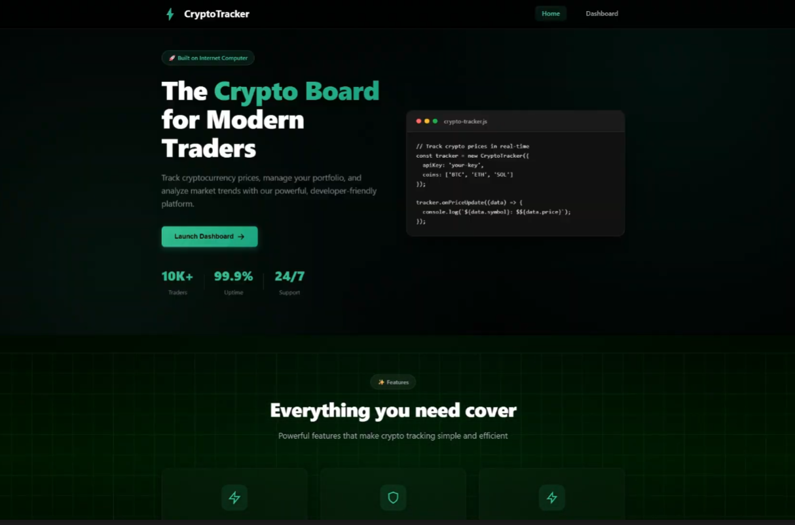
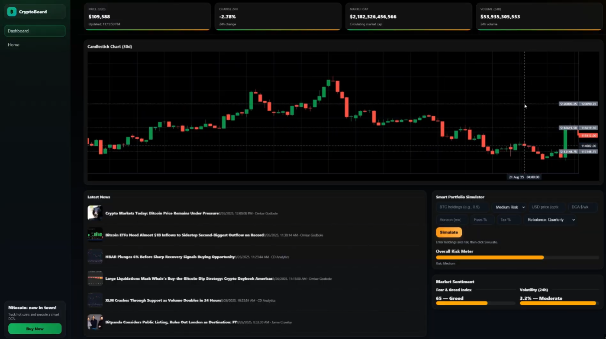

# 🪙 CRYPTO BOARD  

  
Crypto Board is an **AI-powered crypto platform built on ICP**, offering **real-time analysis, predictions, and AI-driven insights** for traders and investors.  

---

## 📱 Overview  

Crypto Board is a next-generation platform that merges **Artificial Intelligence** and **Web3 technology** into one seamless hub for crypto traders and enthusiasts. Built on the **Internet Computer Protocol (ICP)** with **Rust**, it delivers:  

- **AI-driven market predictions**  
- **Real-time on-chain analysis**  
- **Smart portfolio management** powered by AI  

By leveraging **decentralization + AI**, Crypto Board redefines how traders interact with crypto markets.  

  

---

## ❗ Presentation  

You can access the Presentation here:  

🔗 [Introduction to Crypto Board](https://drive.google.com/file/d/159OzsXfqKYea1tBTO5Fhy-iId9Ukpp8K/view?usp=sharing)  

---

## 🚀 Features  

- 🤖 **AI Based BTC Trend Predictions**  
- 📰 **On-chain & Off-chain News Sentiment Analysis**  
- 🧑🏻‍💻 **AI Powered Technical Analysis**  
- 📈 **Interactive Dashboard with Live Trends & Prices**  
- 💸 **Responsive Price Tracker with Alerts**  
- 🌐 **AI Powered Portfolio Manager**  
- 🔓 **Fully Decentralized OnChain (ICP)**  
- 🌐 **Web 3.0 Powered Trading Insights**  

  

---

## 📊 Tokenomics  

Crypto Board introduces its native token **$CBRD** (Crypto Board Token), fueling the ecosystem.  

- **Total Supply**: 100,000,000 $CBRD  
- **Utility**:  
  - 🔐 Access to premium AI trading signals  
  - 🏦 Portfolio optimization & risk-adjusted strategy tools  
  - 📰 Exclusive sentiment & news analytics reports  
  - 📊 DAO governance (future)  
- **Distribution**:  
  - 40% Ecosystem & Rewards  
  - 25% Development & Team  
  - 20% Public Sale & Investors  
  - 10% Partnerships & Integrations  
  - 5% Reserve  

The token aligns incentives for **users, developers, and investors**, ensuring long-term growth and adoption.  

---

## 💻 Roadmap  

**Q3 2025 – Current Phase**  
- ✅ Launch of AI-powered BTC prediction engine  
- ✅ Portfolio manager live on ICP  
- ✅ Investor pitch deck & demo  

**Q4 2025**  
- 🔮 Multi-token support (ETH, SOL, ICP)  
- 🧠 More advanced AI market predictor (LSTM + Transformer hybrid)  
- 🏦 Premium tier with $CBRD utility  

**2026 and Beyond**  
- 🌍 Global rollout with multi-language support  
- 📱 Mobile App (iOS & Android)  
- 🏛️ DAO Governance with $CBRD voting power  
- 🔗 Institutional-grade API integrations  

---

## ❓ FAQ  

**Q: Is it free to use?**  
A: Yes, the core platform is free, but premium AI insights require $CBRD tokens.  

**Q: What powers Crypto Board?**  
A: It is fully decentralized, built on the **Internet Computer (ICP)** with **Rust** backend and a **React-based frontend**.  

---

## 🤖 Tech Stack  

- **Frontend**: React, HTML, CSS, JS  
- **Backend**: Rust  
- **Deployment**: Internet Computer Protocol (ICP)  
- **AI Models**: LSTM, Transformers, Sentiment Analysis  

---

## 🔴 Demo Video  

You can check the Video Demo here:  

🔗 [Crypto Board live demo video](https://drive.google.com/file/d/12t26YTBTAZHtInVP8Dy-deugXs9NAexM/view?usp=sharing)  

---

## 👷🏻‍♂️ Developers  

- Owen — AI Developer  
- Dave — Frontend Developer  
- Leo — Fullstack Developer  
- JoMax — Backend Developer  
- Declan — Fullstack Developer  

---

## 📑 Market Positioning  

Crypto Board sits at the **intersection of AI + DeFi**, tapping into two trillion-dollar markets:  

- 📊 **Crypto Market** – $2.3T+ capitalization  
- 🤖 **AI Market** – projected $1.8T by 2030  

By uniting these, Crypto Board positions itself as a **must-have platform for modern traders**, blending **data, decentralization, and intelligence**.  

---

## 🔧 License  

This project is licensed under the **MIT License**.  
