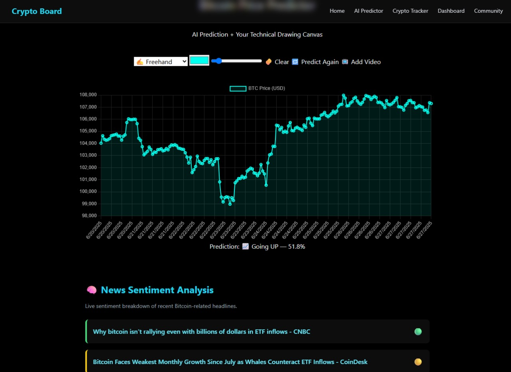
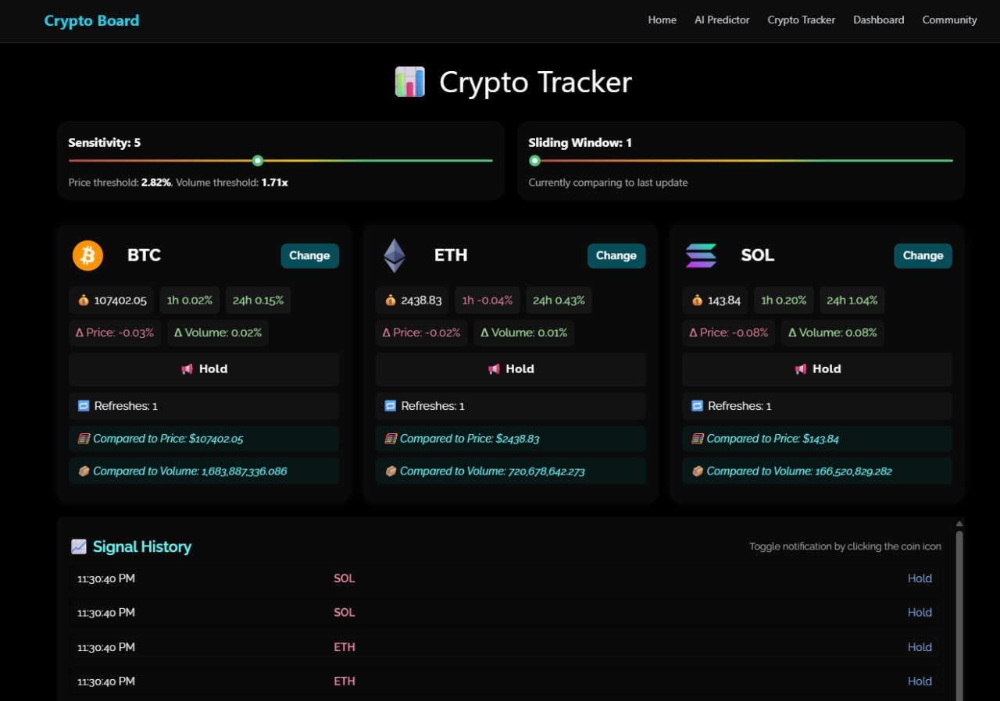

# 🪙 CRYPTO BOARD

Crypto Board is an AI-powered crypto platform built on ICP, offering real-time analysis, predictions, and community-driven insights for traders

---

## 📱 Overview

Crypto Board is a groundbreaking crypto platform that combines blockchain technology and AI into one powerful hub for traders and enthusiasts. Built on ICP using Rust, it offers AI-driven market predictions, real-time analysis, and a space to connect with communities and discuss the hottest tokens on the market.

---

## ❗ Presentation

You can access the Presentation here:

🔗 [Introduction to Crypto Board](https://drive.google.com/file/d/15VX4U0Ab3zrX80sNkZdLg6MwdMerfv7-/view?usp=sharing)

---

## 🌐 Access the Live Demo

You can access the Live Demo Website here:

🔗 [Crypto Board Demo](https://pvbkg-eaaaa-aaaao-a4lsa-cai.icp0.io/)

---

## 🚀 Features

- 🤖 AI Based BTC Trend Predictions

- 📰 News Sentiment Analysis

- 🧑🏻‍💻 Easy to use Technical Analysis Canvas

- 🗣️ Community for Crypto enthusiasts

- 📈 Detailed Dashboard with live trends and prices

- 💸 Responsive Price Tracker with Buy and Sell Signals

- 📱 Doomscroll on Crypto Related Shorts

- 🎮 Games for bored users Deployed on ICP

- 🌐 Responsive UI for all Users

- 🔓 Deployed Decentralized OnChain (ICP)

- 🌐 Web 3.0 Based
  

---

## 💻 Future Plans

- 🖼️ More Supported Tokens

- 🔨 More sophisticated AI trend predictor

- 🌻 Even faster price updates

---

## ❓ FAQ

**Q: Is it free to use?**

A: Yes, it's easy and free to use.

**Q: What powers Crypto Board?**

A: Built on the Internet Computer with RUST.

---

## 🤖 Tech Stack

Frontend: React, HTML, CSS, JS

Backend: RUST

Deployment: Internet Computer Protocol (ICP)

---

## 🔴 Demo Video

You can check the Video Demo here:

🔗 [Crypto Board live demo video](https://youtu.be/7EkBTHwwPp8?si=pLQkmJvnYSrcpj2y)

---

## 👷🏻‍♂️ Developers

- Owen — AI Developer

- Dave — Frontend Developer

- Leo — Fullstack Developer

- JoMax — Backend Developer

- Declan — Fullstack Developer

---

## 🔧 License

This project is licensed under the MIT License.
